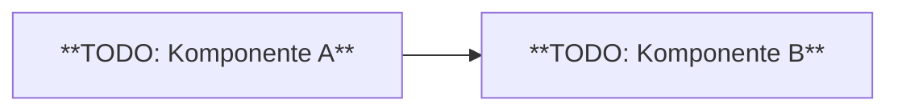

# Document Structure

Every implementation document has **at minimum** three top-level sections in this
order. Do not reorder, merge, or omit the mandatory sections. When updating an
existing document, preserve any additional sections the user has added.

Section titles must match the active language profile:

| Section | `de` (default) | `en` |
|---------|----------------|------|
| 1 | Übersicht | Overview |
| 1.1 | Metadaten-Tabelle | Metadata |
| 1.2 | Prozessübersicht | Process Overview |
| 2 | Einschränkungen, Grenzen und Entscheidungen | Constraints and Decisions |
| 2.1 | Einschränkungen und Grenzen | Constraints and Limits |
| 2.2 | Architekturentscheidungen (ADR) | Architecture Decisions (ADR) |
| 3 | Technische Implementierung | Technical Implementation |
| 3.1 | Architekturübersicht / Prozessübersicht | Architecture Overview / Process Overview |
| 3.2 | Detail-Diagramme | Detail Diagrams |
| 3.3 | Komponentenbeschreibungen | Component Descriptions |

---

## Section 1 — Overview / Übersicht

### 1.1 Metadata Table / Metadaten-Tabelle

Use the template matching the active language profile.

**`en` template:**

| Field | Value |
|-------|-------|
| Author | `<name>` |
| Last updated | `YYYY-MM-DD` |
| Related work items | `<full identifiers>` |

**`de` template:**

| Feld | Wert |
|------|------|
| Autor | `<name>` |
| Letzte Anpassung | `YYYY-MM-DD` |
| Betroffene Arbeitspakete / Aufträge | `<full identifiers>` |

- **Author / Autor**: ask via `AskUserQuestion` if not provided. Do not use a
  placeholder name.
- **Last updated / Letzte Anpassung**: today's date in `YYYY-MM-DD` format (from
  the `currentDate` context variable if available, otherwise derive from system
  information).
- **Related work items / Betroffene Arbeitspakete**: list full story, task, and
  ticket identifiers as provided by the user. Spell them out completely
  (e.g., `STRY0012345`). Do not abbreviate.

If none are known, emit the appropriate placeholder:
- `en`: `**TODO: Add related work items**`
- `de`: `**TODO: Arbeitspakete nachtragen**`

### 1.2 Process Overview / Prozessübersicht

Write 3–5 numbered steps describing the implemented process in plain business
language. This section targets process owners who have no knowledge of ServiceNow.

**Rules**:
- No ServiceNow terminology: no "Business Rule", "Script Include", "update set",
  "sys_id", table names (`cmdb_ci_*`, `sys_*`), or API names.
- Describe what triggers the process, what happens at each step, and what the
  result is for the end user or the business.
- Keep each step to 1–3 sentences.

**Bad example** (`de`) — uses technical terms:
> 1. Ein Business Rule auf `incident` prüft den Wert von `u_mycustomfield`.
> 2. Ein Script Include sendet einen REST-Call an das IAM-System.

**Good example** (`de`) — business language:
> 1. Wenn ein Mitarbeiter eine neue Serviceanfrage erfasst, prüft das System
>    automatisch, ob der gewünschte Service für die betreffende
>    Organisationseinheit freigegeben ist.
> 2. Ist der Service freigegeben, erhält der zuständige Techniker innerhalb
>    von 5 Minuten eine Benachrichtigung.
> 3. Lehnt das externe System die Anfrage ab, wird die Serviceanfrage in einen
>    Wartestatus versetzt und der Antragsteller informiert.

**Bad example** (`en`) — uses technical terms:
> 1. A Business Rule on `incident` checks the value of `u_mycustomfield`.
> 2. A Script Include sends a REST call to the IAM system.

**Good example** (`en`) — business language:
> 1. When an employee submits a new service request, the system automatically
>    checks whether the requested service is approved for their organisational
>    unit.
> 2. If the service is approved, the responsible technician receives a
>    notification within 5 minutes.
> 3. If the external system rejects the request, the service request is put on
>    hold and the requester is informed.

If the process overview cannot be derived from the input, emit the appropriate
placeholder:
- `en`: `**TODO: Add process overview — 3–5 steps in plain business language, no ServiceNow terminology**`
- `de`: `**TODO: Prozessübersicht nachtragen — 3–5 Schritte in Geschäftssprache, ohne ServiceNow-Terminologie**`

---

## Section 2 — Constraints and Decisions / Einschränkungen, Grenzen und Entscheidungen

### 2.1 Constraints and Limits / Einschränkungen und Grenzen

Bulleted list of technical constraints, solution limits, or scope boundaries.
Examples of what belongs here:
- What prerequisites must be met?
- Are there licence constraints or dependencies on external systems or other implementations?
- Are there any known limits (like performance, size)?
- Which scenarios are explicitly not implemented, and why?

If no constraints are derivable from the input sources, emit the appropriate
placeholder:
- `en`: `**TODO: Review and document constraints and limits**`
- `de`: `**TODO: Einschränkungen, Limiten und Grenzen prüfen und ergänzen**`

### 2.2 Architecture Decisions (ADR) / Architekturentscheidungen (ADR)

For each significant design decision, use the template matching the active language
profile.

**`en` template:**

```markdown
### ADR-01: <Short decision title>

- **Status:** Accepted | Under discussion | Rejected
- **Context:** <Why did this decision need to be made?>
- **Decision:** <What was decided?>
- **Consequences:** <What are the consequences — positive and negative?>
```

**`de` template:**

```markdown
### ADR-01: <Kurztitel der Entscheidung>

- **Status:** Akzeptiert | In Diskussion | Abgelehnt
- **Kontext:** <Warum musste diese Entscheidung getroffen werden?>
- **Entscheidung:** <Was wurde entschieden?>
- **Konsequenzen:** <Was sind die Konsequenzen — positiv und negativ?>
```

If no ADR information is derivable from the input, emit one placeholder entry using
the active language template.

**`en` placeholder:**

```markdown
### ADR-01: **TODO**

- **Status:** **TODO**
- **Context:** **TODO: Describe the decision context**
- **Decision:** **TODO: Enter the decision made**
- **Consequences:** **TODO: Describe the consequences**
```

**`de` placeholder:**

```markdown
### ADR-01: **TODO**

- **Status:** **TODO**
- **Kontext:** **TODO: Entscheidungskontext beschreiben**
- **Entscheidung:** **TODO: Getroffene Entscheidung eintragen**
- **Konsequenzen:** **TODO: Konsequenzen beschreiben**
```

Always note in the final summary how many ADR placeholders were emitted.

---

## Section 3 — Technical Implementation / Technische Implementierung

### 3.1 Architecture Overview / Process Overview (required, always first)

The first diagram is audience-dependent (see SKILL.md §6 and
`references/mermaid-guidelines.md` Rule 1):
- `process-owners` in audience → **process overview** diagram first (business
  flow, no component names or API detail)
- `technicians` / `developers` only → **architecture overview** diagram first

This diagram is mandatory. If no suitable diagram can be clearly derived from the
input, emit a minimal placeholder:



And add the appropriate placeholder:
- `en`: `**TODO: Complete architecture overview**`
- `de`: `**TODO: Architekturübersicht vervollständigen**`

### 3.2 Detail Diagrams / Detail-Diagramme (optional)

Add focused diagrams for specific flows only when they clarify something the
architecture overview cannot show at its level of abstraction. Examples:
- API request/response sequence
- Data transformation flow
- State machine for a complex workflow

See `references/mermaid-guidelines.md` for diagram type templates.

### 3.3 Component Descriptions / Komponentenbeschreibungen

Describe the key implemented components. Focus on:
- What the component does (behaviour, not just its name)
- Why it exists (what problem it solves)
- Non-obvious interactions with other components

**Do not list every modified artefact.** A Business Rule with simple validation
logic does not need its own subsection. A Script Include that orchestrates a
complex integration does.

Use H3 (`###`) headings named after the function or concept, not the artefact name:
- Good (`en`): `### Permission Check on Create`
- Good (`de`): `### Berechtigungsprüfung beim Erstellen`
- Avoid: `### BiHaCheckPermissionOnCreate`
