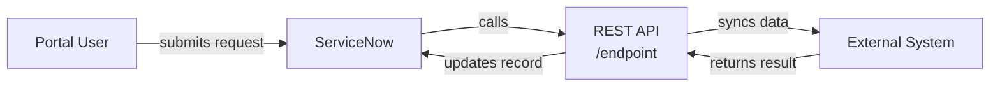
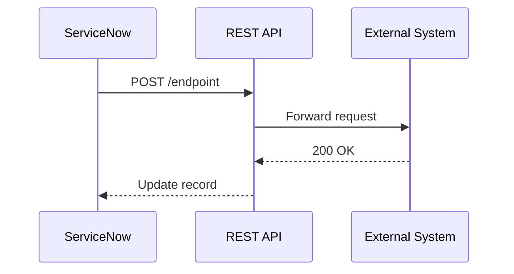
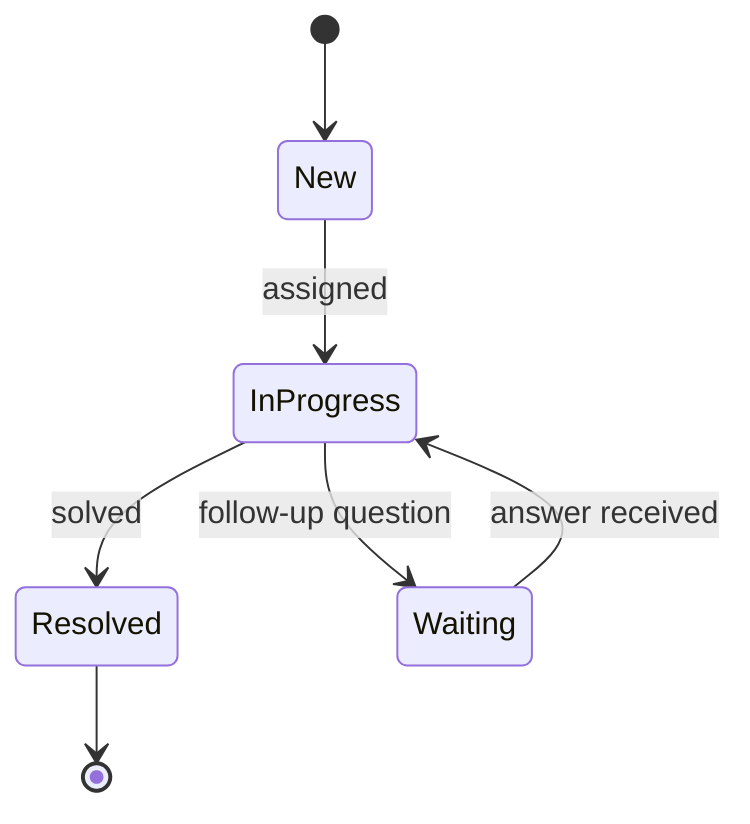
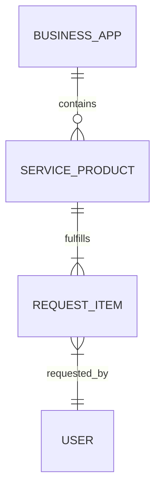

# Mermaid Diagram Guidelines

---

## Rules

1. **Audience-appropriate diagram first.** The first diagram in Section 3 depends
   on the configured audience:
   - `process-owners` in audience → **process overview** first (business flow,
     no component names, no API detail)
   - `technicians` / `developers` only → **architecture overview** first

   No detail diagram may appear before the first mandatory diagram.

2. **One focused detail diagram per topic.** Add detail diagrams only when they
   clarify something the architecture overview cannot show at its abstraction level.
   Each detail diagram has a specific purpose: API sequence, data flow, state
   machine, data model.

3. **Multiple small diagrams over one large one.** If a diagram grows beyond ~10
   nodes or becomes crowded, split it. A "full system" diagram is almost always the
   wrong level of detail.

4. **Consistent direction per diagram.** Use either `LR` (left-to-right) or `TB`
   (top-to-bottom). Never mix within one diagram. Default is `LR` (from project
   config `diagrams.default_direction`).

5. **Node labels: ≤4 words.** Use ` ` to split across two lines if needed.
   Never use `\n`.

6. **Edge labels: ≤3 words.** Omit the label entirely if the relationship is
   obvious from the arrow direction and node names.

7. **No secrets, sys_ids, or personal data in diagrams.** See
   `references/mermaid-ink-integration.md` for the full sanitization checklist
   before rendering images.

---

## Templates

### Architecture overview (flowchart LR)

Use this as the first diagram in every document.

### API / integration sequence

Use for documenting a specific request/response flow between systems.

### State machine

Use when documenting a record lifecycle or approval workflow.

### Data model (ER)

Use when documenting table relationships relevant to the implementation.

---

## Anti-patterns

| Anti-pattern | Fix |
|---|---|
| 30+ nodes in one diagram | Split: one architecture overview + 2–3 focused diagrams |
| Every edge has the same label (e.g., "calls") | Omit labels that add no information |
| Node labels contain full class names or sys_ids | Use short business names: "CMDB", "Incident Manager" |
| Mixing `LR` and `TB` within one diagram | Pick one direction and keep it throughout |
| `\n` in node labels | Use ` ` instead |
| One giant sequence diagram covering all scenarios | One sequence diagram per distinct flow |
