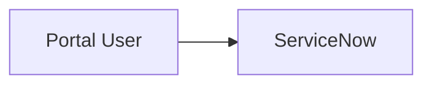

# Mermaid.ink Image Rendering

Use this procedure **only** when one of these conditions is met:
- The project config contains `"mermaid": { "render": "image" }`
- The user explicitly states the target documentation system does not render
  mermaid code blocks

In all other cases, emit the mermaid code block only.

The mermaid code block is **always kept in the document**, regardless of whether
an image is also rendered.

---

## Step 1 — Sanitization (mandatory before encoding)

Check every node label, edge label, and comment in the mermaid source. If **any**
item below fails, do not proceed with the upload. Ask the user to revise the
diagram via `AskUserQuestion`, describing exactly what was flagged.

- [ ] No password, token, API key, client secret, or OAuth credential
- [ ] No sys_id (32-character hexadecimal string)
- [ ] No internal hostname or instance URL
  (e.g., `customerA.service-now.com`)
- [ ] No real username, email address, or personal name — replace with role labels
  such as "Technician", "Process Owner", "Requester"
- [ ] No raw IP address
- [ ] No connection alias or profile name that reveals the environment
  (e.g., `prod_oauth_customerA`)
- [ ] No customer-internal employee or asset IDs (unless explicitly approved by
  the user for this specific document)

If all items pass: proceed to Step 2.

---

## Step 2 — Encode the mermaid source

Use this Bash one-liner to produce URL-safe base64 encoding from the mermaid source:

```bash
python -c "import base64,sys; data=sys.stdin.read(); print(base64.urlsafe_b64encode(data.encode()).decode().rstrip('='))" < diagram.mmd
```

Or inline with a heredoc:

```bash
python -c "import base64,sys; data=sys.stdin.read(); print(base64.urlsafe_b64encode(data.encode()).decode().rstrip('='))" <<'EOF'
flowchart LR
    A --> B
EOF
```

The resulting string is the `<encoded>` value.

---

## Step 3 — Fetch and save the image

Construct the URL:

```
https://mermaid.ink/img/<encoded>?type=png
```

Fetch and save using `curl` (binary-safe; `WebFetch` returns text only and cannot
save binary files):

```bash
curl -fsSL "https://mermaid.ink/img/<encoded>?type=png" -o "<images_folder>/<filename>.png"
```

**Filename rules:**
- All lowercase, hyphens only (no spaces, no underscores)
- Pattern: `<doc-stem>-<diagram-id>.png`
- Example: `biha-stry0012345-v01-architecture.png`
- Save to `images_folder` from the project config (default: `docs/images/`)

If the `images_folder` does not exist, create it:

```bash
mkdir -p "<images_folder>"
```

---

## Step 4 — Embed in the document

Always keep the mermaid code block **and** add the image reference directly below
it:

~~~markdown



~~~

The mermaid block ensures the diagram stays editable and renders natively on
systems that support mermaid. The image provides a fallback for systems that do not.

---

## Diagram ID convention

| Document | Diagram purpose | Resulting filename |
|---|---|---|
| `biha-stry0012345-v01-implementation.md` | Architecture overview | `biha-stry0012345-v01-architecture.png` |
| `biha-stry0012345-v01-implementation.md` | Data flow detail | `biha-stry0012345-v01-dataflow.png` |
| `cmdb-sync-implementation.md` | API sequence | `cmdb-sync-api-sequence.png` |

Use a short, descriptive identifier derived from the document name and the diagram's
purpose.
